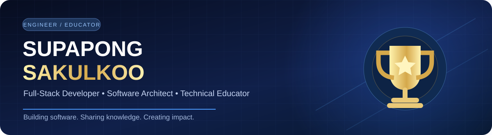
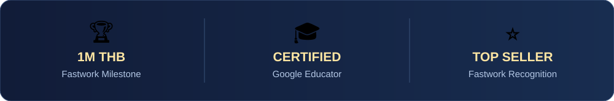

 

 

**`FULL-STACK DEVELOPMENT`** · **`SOFTWARE ARCHITECTURE`** · **`WORDPRESS`** · **`DEVELOPER TOOLS`**

---

## 🏆 GitHub Achievement Gallery

<!-- REPLACE YOUR_GITHUB_USERNAME below with your actual GitHub username. These trophies are calculated from real GitHub activity, not manually awarded. -->

## 📈 Developer Dashboard

 

 

> **Setup:** Replace every `YOUR_GITHUB_USERNAME` with your GitHub handle. External statistics providers can temporarily rate-limit or fail; your profile and projects will still display normally.

---

## 🚀 About Me

I'm **Supapong Sakulkoo (คุณอู๋)**, a Thailand-based full-stack developer, WordPress specialist, software consultant, and programming instructor. I work across web applications, browser extensions, developer tools, APIs, technical architecture, and digital products.

- 🏦 Former **Backend Developer at Bangkok Bank**
- 🧭 Software and technical architecture consultant for public- and private-sector organizations
- 🏆 **Fastwork 1 Million Milestone** award recipient; **Fastwork Top Seller**
- 🎓 **Google Certified Educator**
- 🧑‍🏫 Programming instructor on **FutureSkill**, **SkillLane**, and **The Blacksmith by PTR**
- 🌏 Interested in practical developer tooling, scalable services, SEO, AEO, and GEO

## 🛠️ Tech & Focus Areas

**Focus:** Full-stack web development · REST APIs · Browser extensions · VS Code extensions · WordPress plugins · Software architecture · Automation · Technical SEO / AEO / GEO

## 💎 Featured Products & Developer Tools

### 🌌 SweetieSS Ecosystem

  
   
  Meet Sweetie — the mascot behind the SweetieSS ecosystem

| Product | Overview | Link |
| --- | --- | --- |
| **SweetieSS Discord Application** | Fortune-telling Discord application with a reported reach of over **2 million users**. | [Add link](YOUR_SWEETIESS_DISCORD_URL) |
| **SweetieSS LINE Official Account** | LINE-based services and community with **2,000+ users/friends**. | [Add link](YOUR_SWEETIESS_LINE_URL) |
| **Discord Thailand** | Founder of the Thailand-focused Discord community and website. | [discordthailand.com](https://discordthailand.com/) |

### 🌐 Chrome Extensions

| Extension | What it does | Link |
| --- | --- | --- |
| **SweetieCinema for YouTube** | Adds ambient light, an IMAX-style wall, and cinematic audio modes to YouTube. | [Chrome Web Store](https://chromewebstore.google.com/detail/sweetiecinema-for-youtube/egamglkhnkkdhgjhlpbbhfecnbkcdgkm) · [Website](https://supapongai.com/sweetiecinema-for-youtube/) |
| **PixelcraftDev SEO Checker** | Inspects on-page SEO, indexability, basic security signals, and WordPress-related checks. | [Chrome Web Store](https://chromewebstore.google.com/detail/cjogepaamccegccccaolofnckkfedcni) |
| **Security Checker** | Browser-based website security checks. | [Add link](YOUR_SECURITY_CHECKER_URL) |

### 🧩 VS Code Extensions

| Extension | Focus | Link |
| --- | --- | --- |
| **Java Visual Tools** | Developer tooling for Java workflows. | [Add marketplace link](YOUR_JAVA_VISUAL_TOOLS_URL) |
| **ASP.NET Visual Tools** | Developer tooling for ASP.NET workflows. | [Add marketplace link](YOUR_ASPNET_VISUAL_TOOLS_URL) |
| **API Breakage Radar** | Tools for identifying and monitoring potential API compatibility changes. | [Add marketplace link](YOUR_API_BREAKAGE_RADAR_URL) |

### 🧱 WordPress & API Services

- **WordPress.org Plugin Publisher:** WooCommerce payment notification plugin and Elementor addon. [Plugin profile / links](YOUR_WORDPRESS_ORG_PROFILE_URL)
- **API Development & Services:** Custom APIs, data integrations, operations, and maintenance. [Learn more](https://supapongai.com/)
- **Software Maintenance & Consultation:** Technical support, system architecture, and long-term maintenance for organizations and businesses.

## 💼 Professional Experience

| Role | Organization / Area |
| --- | --- |
| **Backend Developer (former)** | **Bangkok Bank** |
| **Software & Technical Architecture Consultant** | Public- and private-sector organizations |
| **Full-Stack / WordPress Developer** | Independent projects, consulting, and client solutions |

## 🥇 Recognition & Certifications

- 🏆 **Fastwork 1 Million Milestone** — Recognition for exceeding THB 1 million in sales on Fastwork.
- ⭐ **Fastwork Top Seller** — WordPress development specialist.
- 🎓 **Google Certified Educator** — Google for Education certification.

## 🎤 Teaching & Speaking

| Platform | Subject |
| --- | --- |
| **FutureSkill** | Java programming & Object-Oriented Programming (OOP) |
| **SkillLane** | Web Scraping |
| **The Blacksmith by PTR** | Python programming |

Available for **technical workshops, onsite/online training, and developer education**.

## 📚 Research & Publications

1. **NCCIT 2021** — *Thai Food Recognition on LINE Chatbot with YOLOv5 and Faster R-CNN*.
2. **AUCC 2022** — *Thai Food Recognition and Nutritional Value Estimation via LINE Chatbot Using Deep Learning* (English rendering of the Thai title).

> Publication links and bibliographic details can be added here when available.

## ✨ Let’s Build Something Great

I help businesses and organizations with **full-stack development, large-scale system design, WordPress development, API services, technical consulting, online business strategy, and SEO / AEO / GEO**.

**Open to consulting, development projects, and technical speaking engagements — onsite or online.**

📞 **+66 81 545 9423** · 🌐 **[supapongai.com](https://supapongai.com/)**

---

*Made with care by Supapong Sakulkoo · Thailand 🇹🇭*

